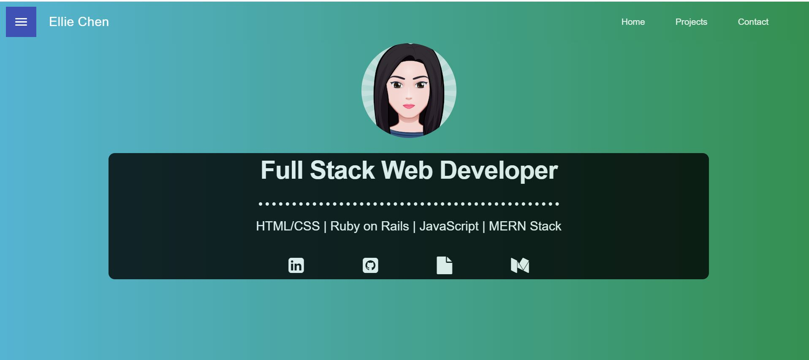
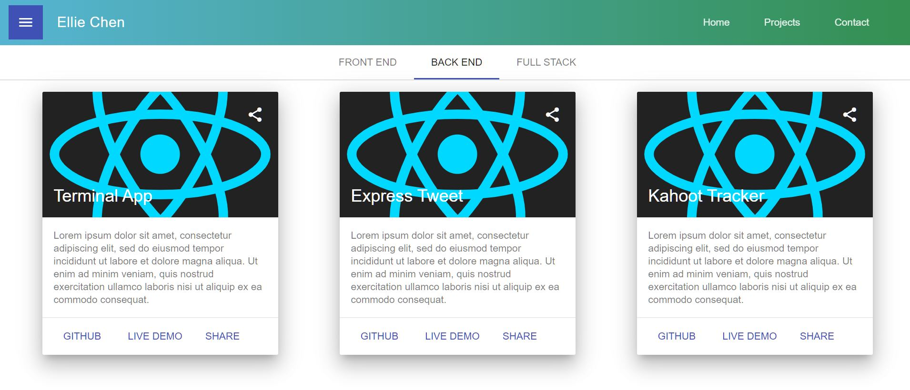
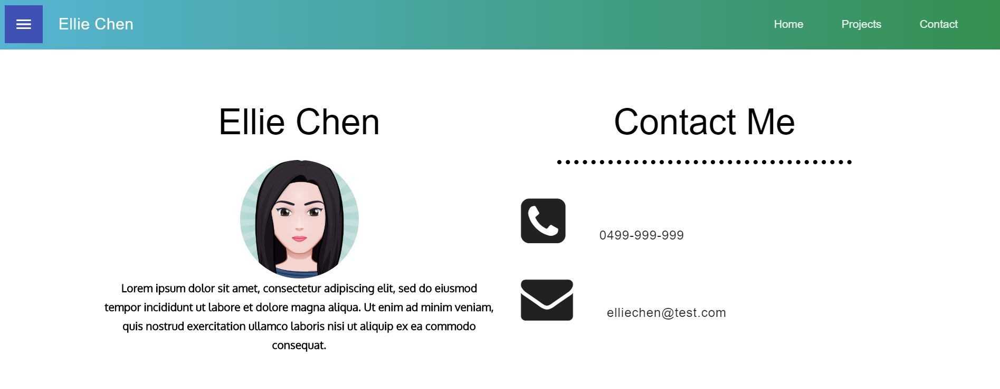

# React Practice - Portfolio Site

- React practice following a YouTube tutorial.

---

### Screenshot

1. Landing Page



2. Projects



3. Contact Page



---

### Update

- 26/12 Switching from Material Design to Bootstrap on app.js (updated navbar to be responsive)
- 04/01 Built contact form & Implemented SASS
- 05/01 Added social icons on navbar & footer

---

### To-do

- Projects page: Change from react-mdl to bootstrap, build project cards
- Landing: Need to adjust navbar order

---

### YouTube Tutorial

1. [Create React App Tutorial - Portfolio website with React Router v4 and Material design](https://www.youtube.com/watch?v=9AboneIxeM8&list=WL&index=13&t=0s)

2. [Create React App Portfolio website Tutorial - Designing the landing page](https://www.youtube.com/watch?v=n8iA18R76jk&list=WL&index=8)

3. [Create React App Portfolio website Tutorial - Designing the Projects Page](https://www.youtube.com/watch?v=tXVmcNNZrm8&list=PL3KAvm6JMiowqFTXj3oPQkhP7aCgRHFTm&index=3)

4. [Create React App Portfolio website Tutorial - Designing the contact page](https://www.youtube.com/watch?v=YbCxwycqEDg)

#### Ellie's note:

- **Overall Verdict**: It's an easy-to-follow tutorial! The only thing I don't like is that the author used a deprecated npm 'React MDL'. As he didn't explain much about the code, I didn't learn much about React with this tutorial.
- **Suitable**: People who just start learning React, html & CSS and wish to build a very simple portfolio website.
- **Not suitable**: People who want to learn some intermediate React knowledge. People who want to be build a responsive website.

---

### Dependencies used by author

**1. React MDL**: React-MDL is a set of React components build on top of Material Design Lite (Warning: This library is now deprecated. It's highly recommended to use Material Design Components instead.)

- **Official site**: https://tleunen.github.io/react-mdl/
- **GitHub**: https://github.com/tleunen/react-mdl

**2. React Router Dom**: DOM bindings for React Router.

- **NPM**: https://www.npmjs.com/package/react-router-dom

**3. UI Gradients**: https://uigradients.com/#EmeraldWater

**4. Font Awesome (4.7.0)**:

- **CDN**: https://maxcdn.bootstrapcdn.com/font-awesome/4.7.0/css/font-awesome.min.css

- **Icon list**: https://fontawesome.com/v4.7.0/icons/

### Dependencies added by Ellie

**5. Bootstrap (4.4.1)**

- **NPM**: https://www.npmjs.com/package/bootstrap
- **Documentation**: https://getbootstrap.com/
- The author didn't use Bootstrap in his tutorial. I decided to use Bootstrap & React Bootstrap in this project to practice Bootstrap.

**6. React Bootstrap (1.0.0-beta.16)**

- **NPM**: https://www.npmjs.com/package/react-bootstrap
- **Documentation**: https://react-bootstrap.github.io/getting-started/introduction

**7. normalize.css**

**8. node-sass**: Node-sass is a library that provides binding for Node.js to LibSass, the C version of the popular stylesheet preprocessor, Sass. It allows you to natively compile .scss files to css at incredible speed and automatically via a connect middleware.

- **Create React App - Using a Custom Theme (SASS)**:https://create-react-app.dev/docs/adding-bootstrap/#using-a-custom-theme
- **NPM**: https://www.npmjs.com/package/node-sass

(1) npm install --save node-sass
(2) create a file called src/custom.scss

```javascript
//@import '~bootstrap/scss/bootstrap.scss';  //this one doesn't work
@import "../node_modules/bootstrap/scss/bootstrap";
```

(3) src\App.js

```javascript
// import './custom.scss'; //Don't need this one either
import "./App.css";
```

(4) Move all the styles from 'src\App.css' to 'src\custom.scss'

(5) Compilation

```
sass src/custom.scss src/App.css
```

(6) Go to public\index.html & remove bootstrap cdn

```javascript
// <link
//   rel="stylesheet"
//   href="https://maxcdn.bootstrapcdn.com/bootstrap/4.3.1/css/bootstrap.min.css"
//   integrity="sha384-ggOyR0iXCbMQv3Xipma34MD+dH/1fQ784/j6cY/iJTQUOhcWr7x9JvoRxT2MZw1T"
//   crossorigin="anonymous"
// />
```

(7) How to override bootstrap default styles

- Ref: https://getbootstrap.com/docs/4.4/getting-started/theming/#sass
- Go to src\custom.scss & write your customised code before the import statement

```javascript
$theme-colors: (
  "info": red
);

// @import "~bootstrap/scss/bootstrap.scss";
@import "../node_modules/bootstrap/scss/bootstrap";
``
```

- Re-compile it and it works

```javascript
// sass src/custom.scss src/App.css

sass --watch src/custom.scss:src/App.css //can use watch command to automatically watch styles changes

```

(8) Before pushing to GitHub, remember add this line to .gitignore!!!

```
/.sass-cache
```

Ref: https://stackoverflow.com/questions/34449222/why-isnt-gitignore-ignoring-sass-cache
